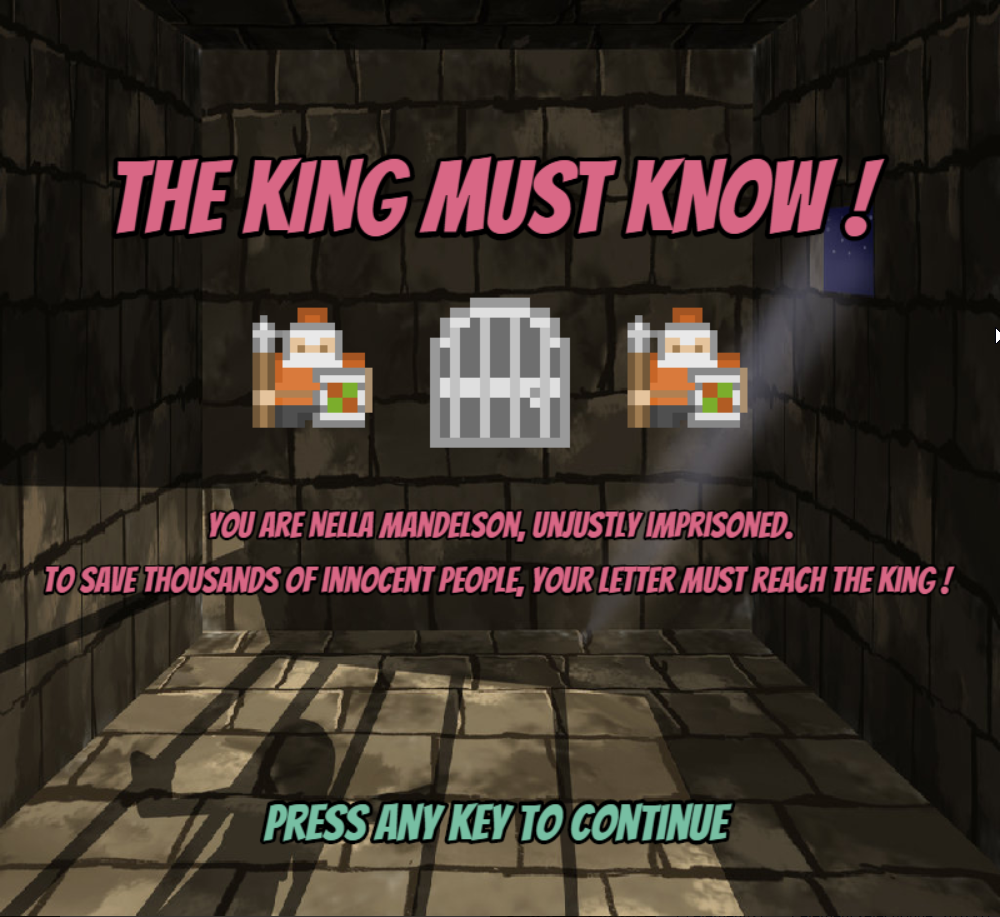
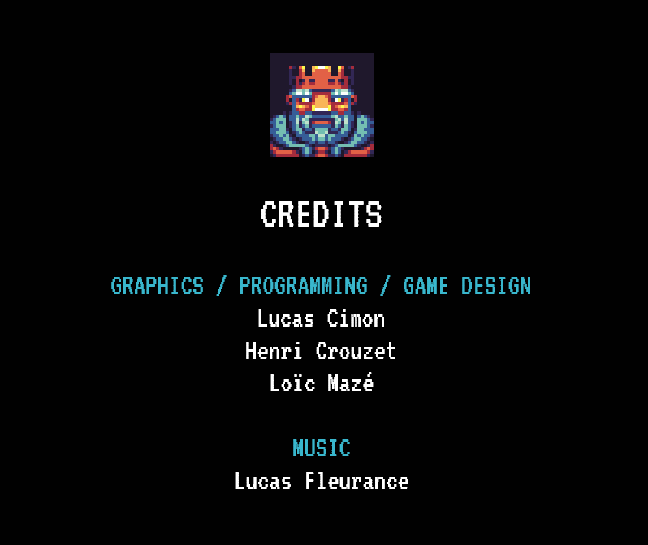

# THE KING MUST KNOW !

**Oh no !** 
Nella Mandelson has been captured !
She is imprisoned into the impenetrable jail of 'Sarvax'.
The hand of the King is comploting the extermination of thousands of innocent

Only you, Nella, may attempt to deliver **THE** important letter to the king and avoid the massacre.
But will you manage to avoid ambushes and to do it in time ?

Online version : https://lucas-c.github.io/OuiJam2018/build

GGJ 2018 page : https://globalgamejam.org/2018/games/king-must-know



## Code

Fork from https://github.com/lean/phaser-es6-webpack

```npm install``` to download the dependencies

```npm run dev``` to start the game

```npm run deploy``` to build a standalone version

## The Team



A big thanks to [Lucas Fleurance](https://globalgamejam.org/users/lucasfleur) who has composed our musical theme during the jam !

## External Ressources

**Kenney.nl :**
- [roguelike-rpg-pack](http://kenney.nl/assets/roguelike-rpg-pack)
- [roguelike-characters](http://kenney.nl/assets/roguelike-characters)
- [roguelike-caves-dungeons](http://kenney.nl/assets/roguelike-caves-dungeons)
- [roguelike-indoors](http://kenney.nl/assets/roguelike-indoors)

**DeviantArt :**
- [Medieval Jail](https://yonglin.deviantart.com/art/Medieval-Jail-370750461) by Yong Lin from DevianArt

**OpenGameArt.org :**
- [24x32-black-character-pack](https://opengameart.org/content/24x32-black-character-pack)
- [rpg-portraits](https://opengameart.org/content/rpg-portraits)

**OpenClipArt.org :**
- [Skulls](https://openclipart.org/detail/271180/skull-emoji)
- [Warning sign](https://openclipart.org/detail/293958/warningsigngeneral1)

**Sounds :**
- The sounds came from [this rpg-sound-pack](https://opengameart.org/content/rpg-sound-pack).

## License

<a rel="license" href="http://creativecommons.org/licenses/by-nc-sa/4.0/"></a><br />Le contenu de ce dépôt est sous license <a rel="license" href="http://creativecommons.org/licenses/by-nc-sa/4.0/">Creative Commons Attribution-NonCommercial-ShareAlike International</a>
